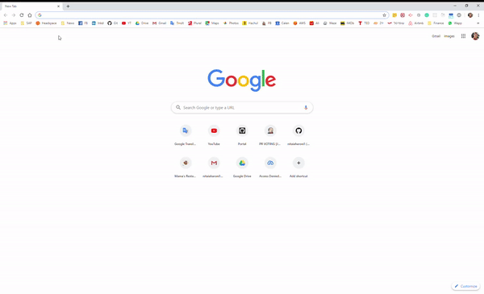
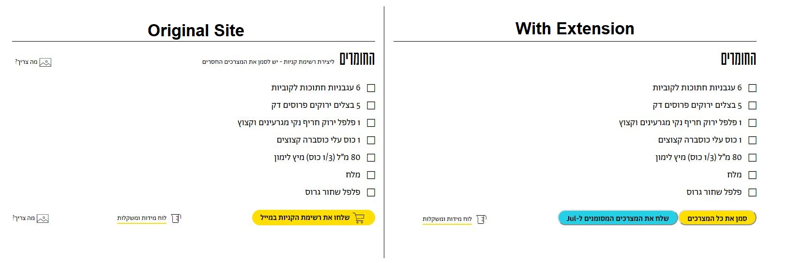
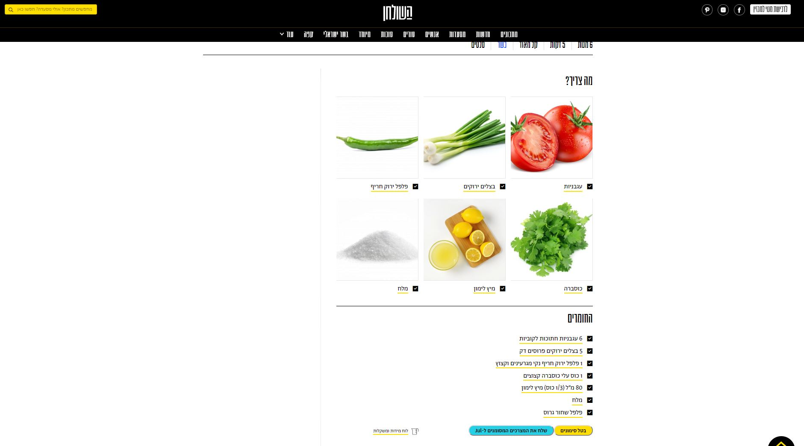
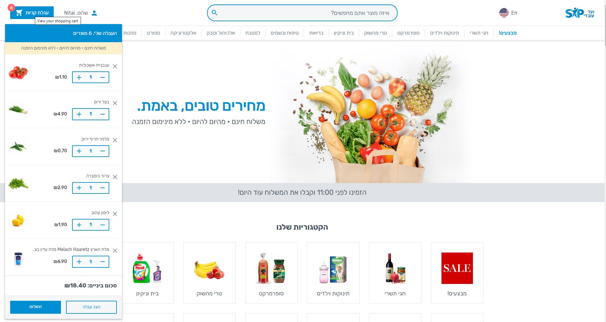

# Jul-Hachulchan Chrome Extension
**Jul-Hachulchan** is an Integration plugin between the recipe site "Hachulchan" and the supermarket site "Jul", both are public, unrelated websites.
The extension adds a "Submit the Products marked to Jul" button to the recipes website which sends the selected groceries to the supermarket site and adds them to the cart.
This creates a connection between the two unrelated sites, allowing products to be added to the cart according to a recipe

The plugin edits the HTML of the "Hachulchan" site while adding buttons to it.
Used reverse engineering, discovered the API, and used it to send a request to the "Jul" site and add the groceries to the cart

Hachulchan: [https://www.hashulchan.co.il](https://www.hashulchan.co.il/)
Jul: [https://jul.co.il/](https://jul.co.il/)

## Demo:

## Screenshots
##### Added Buttons (with and without the extension):

##### Choose ingredients:

##### Jul Supermarket website cart:

## How to setup?

 1. Fork/Clone repo
 2. `npm run build`
 3. Go to chrome://extensions/
 4. swith to "Developer mode"
 5. Click "Load unpacked"
 6. Select folder `/build`
